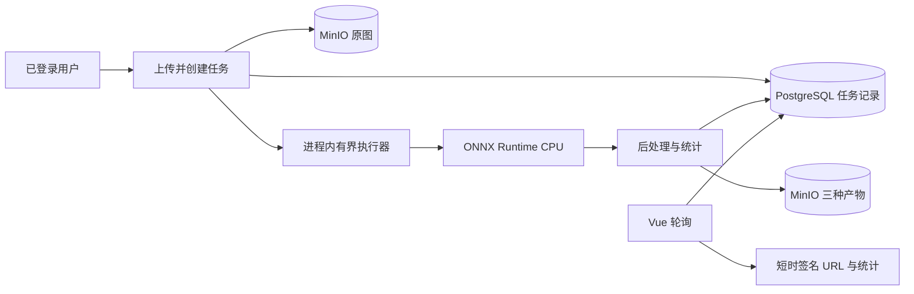
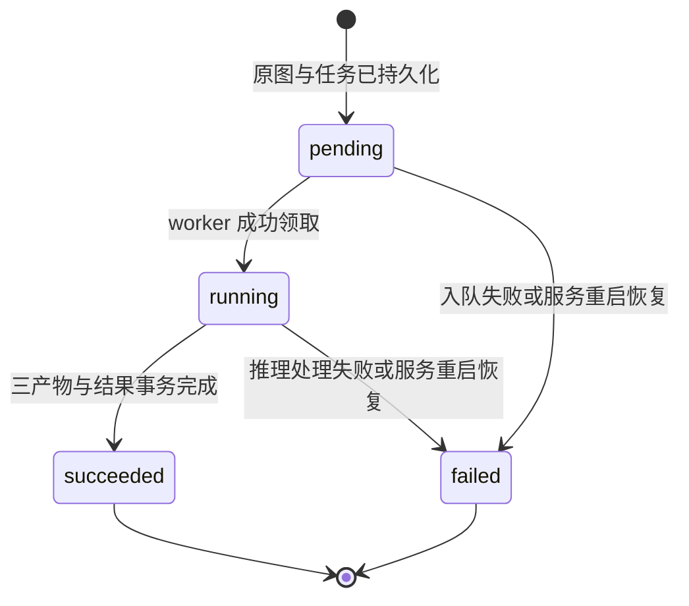

# YOLO26 Semantic 稳定接入 MVP 实施规范

## 1. 目标与边界

本文是现有 FastAPI/Vue 系统接入 LoveDA YOLO26n Semantic 模型的增量实施规范，供 Code 模式直接执行。

MVP 仅实现：

1. 已登录用户上传单张遥感图。
2. 创建语义分割任务并异步执行。
3. 生成索引 mask、彩色 mask、原图叠加图。
4. 统计 7 个公开类别的像素数与占比。
5. 保存任务引用的模型版本快照及完整推理元数据。
6. 前端轮询任务并展示图像产物、图例、类别占比和错误。

明确不实现：需求文档全部 16 表、多 Agent、变化检测、训练管理、批量上传、WebSocket、Celery/RQ、模型在线上传与切换、人工标注与报告生成。保留现有检测/训练/聊天模板，但本增量不扩展这些能力。

## 2. 现状审阅结论

### 2.1 后端

- `app/entity/db_models.py` 已有 `User`、`DetectionScene`、`DetectionTask`、`DetectionResult`、`ModelVersion` 等检测导向实体。`DetectionResult` 的 bbox、confidence、逐目标记录不适合语义 mask；不应将每个类别伪装成检测框记录。
- `app/entity/schemas.py` 已有检测 schema，但未表达对象 key、mask、像素统计、运行时、预处理和模型校验和。
- `main.py` 仅注册 auth/health 路由，适合增量注册 segmentation 路由，并在 lifespan 初始化推理运行时及恢复遗留任务。
- `app/api/auth.py` 的 `get_current_user` 可直接作为所有分割接口的鉴权依赖。所有任务查询必须附加 `user_id == current_user.id` 所有权过滤，不能仅凭任务 ID 查询。
- `app/storage/minio_client.py` 具备上传、签名 URL、删除能力，但把临时 URL作为上传返回值；数据库应保存稳定 object key，响应时再生成短时签名 URL。需增加流式上传/下载或对象读取、存在性检查、可配置短时签名等接口。
- `app/config/settings.py` 未包含模型、上传和推理配置。
- 初始 Alembic 已一次创建模板表；本次必须新增独立 revision，不修改历史 revision。
- 依赖已有 ultralytics/OpenCV，但缺 `onnxruntime`、Pillow、NumPy 的显式固定依赖。
- 全局异常格式为 `{success, code, message, details?}`，而前端当前只读取 `detail`，需统一兼容读取 `message`。

### 2.2 前端

- `src/router/index.js` 的 `/detection` 已受登录守卫保护，可保留路径并将标题改为“语义分割”。
- `src/views/DetectionPage.vue` 是纯占位页，可原位替换为 MVP 工作台，避免新增重复路由。
- `src/components/layout/AppSidebar.vue` 应同步修改菜单文本。
- `src/utils/request.js` 已自动注入 Bearer token，但 30 秒超时不适用于客户端直接等待推理；本方案创建接口快速返回，轮询查询，因此可沿用。错误提取需兼容 `response.data.message`。
- 目前没有 segmentation API/store；应分别新增，不能复用 chat 的 agent store。
- Element Plus 已提供上传、进度、表格、提示组件，不新增图表库；占比 MVP 使用进度条/表格即可。

## 3. 模型部署事实与关键纠偏

部署目录：`src/training/loveda_semantic/artifacts/baseline_e50_i512_b2/deploy/`。

已确认：

- 主模型：`best_dynamic.onnx`；回退模型：`best.pt`。
- 输入名 `images`，RGB、float32、NCHW、缩放到 `[0,1]`，空间尺寸 512×512，动态 batch。
- ONNX 实际输出名 `output0`，语义是后处理后的 class-id map，形状 `[N,512,512]`，不是 logits。实现不得再对 ONNX 输出做通道 argmax。`INFERENCE.md` 的“输出 logits 后 argmax”与 `metadata.json`、`export_status.json` 的运行时验证冲突，以后两者和实际 session introspection 为准。
- 公开类别为 0..6；若任一引擎产生内部类别 7，必须折叠为 0。输出中的其他类别值视为模型契约错误。
- 255 只用于 ground-truth ignore，不得出现在部署产物或占比统计中。
- ONNX 已由 CPUExecutionProvider 验证，batch=1 时与 PT class map 像素一致率为 1.0。
- 模型文件 SHA256：ONNX `a5f7c887c20d628aabc2b8a834f6f376d4919687ebc7d2bc97f51fb9e413ba90`；PT `c147eff5a13d63183b4efb7d89417f7ace5354f708befd019908b5b8c2196ad9`。

公开类别及颜色：

| id | name | RGB |
|---:|---|---|
| 0 | background | 0,0,0 |
| 1 | building | 255,64,64 |
| 2 | road | 255,200,64 |
| 3 | water | 64,160,255 |
| 4 | barren | 180,120,64 |
| 5 | forest | 64,180,96 |
| 6 | agricultural | 180,220,64 |

类别名、颜色、输入契约必须从随模型部署的 `metadata.json` 加载并验证，不在业务代码中维护第二份真源；可为 UI 响应追加固定中文显示名映射。

## 4. 总体方案



采用“单 FastAPI 进程 + 进程内有界后台执行器 + 前端轮询”。创建接口在原图入库及任务记录提交后返回 202。执行器并发默认 1、内存队列有界，适用于单机、低并发 MVP。生产启动必须使用单个 Uvicorn worker；多 worker 会各自加载模型且无法共享队列，不属于本方案支持范围。

不使用 FastAPI `BackgroundTasks` 直接无限制启动推理；应创建应用级 `ThreadPoolExecutor(max_workers=1)` 或等价有界调度器，并用信号量限制排队任务数。同步 ORT 推理在线程中执行，避免阻塞事件循环。后台线程必须自行创建并关闭 SQLAlchemy Session，不复用请求 Session。

## 5. 推理引擎选择

### 5.1 主方案：ONNX Runtime CPU

理由：

- 部署包已经 CPU provider 实测，输出契约和 PT 像素完全一致。
- 当前后端依赖模板未证明部署主机具备 CUDA、驱动或匹配版 PyTorch。
- `onnxruntime` CPU 安装与发布最简单，避免 CUDA/PyTorch/ultralytics 版本耦合。
- 单图、低并发 MVP 更重视可重复部署和稳定性，而非 GPU 吞吐。

启动时只创建一个进程级 `InferenceSession` 并复用，providers 显式设为 `CPUExecutionProvider`。校验：模型与 metadata 存在；可选严格 SHA256；输入名、dtype、rank、固定 C/H/W；输出名、rank；用全零或固定合成图 warm-up，断言输出 `[1,512,512]` 且 class id 经折叠后仅为 0..6。失败时服务保持可启动但 segmentation readiness 为 unavailable，创建任务返回 503，不应让 auth/health 全部不可用。

预处理基线：Pillow 解码并 `ImageOps.exif_transpose`，统一 RGB，直接双线性缩放为 512×512，转 float32 `[0,1]`，HWC→CHW，增加 batch。这里选择直接缩放而非 letterbox，以匹配导出验证中固定 512 class map 且避免不明确的 padding 语义。索引 mask 使用最近邻恢复到原图尺寸。必须在推理元数据记录 `resize_mode=stretch`、源尺寸和模型输入尺寸。

后处理：将 `[1,512,512]` 转为整数二维数组；7→0；校验 0..6；最近邻缩放到原始宽高；以 uint8 单通道 PNG 保存索引 mask；按 metadata palette 映射 RGB 彩色 mask；叠加图使用 `original * 0.55 + color_mask * 0.45` 并保存 RGB PNG。占比基于恢复到原尺寸后的索引 mask，用 `bincount(minlength=7)`，每类 `ratio = pixel_count / (width*height)`；响应中的 ratio 保留原始浮点值，前端格式化百分比。

### 5.2 回退方案：PT GPU

仅当环境明确满足 NVIDIA 驱动、CUDA、PyTorch、ultralytics 兼容并通过启动 warm-up 时启用。配置 `SEMANTIC_ENGINE=pt`，加载 `best.pt`，设备默认 `cuda:0`；调用 `predict(imgsz=512)` 并读取 `result.semantic_mask.data`，7→0，再按相同公共后处理生成完全一致的领域结果对象。

PT 是显式运维切换，不是单请求失败后自动切换：自动静默回退会导致延迟、资源与结果来源不可预测。若 PT 初始化失败，可在配置允许 `SEMANTIC_FALLBACK_TO_ONNX=true` 时启动期回退至 ONNX CPU，并把实际 engine/provider 写入任务元数据和日志。ONNX 推理中途失败则任务 failed，不对同一任务自动改引擎重跑。

## 6. 最小增量数据模型

保留既有 16 表模板，不扩展 detection 表以承担 semantic 语义。新增且仅新增两张表：`semantic_tasks` 与 `semantic_results`。模型版本不新增表，复用 `model_versions`，但通过迁移新增通用语义字段并写入一个系统部署版本记录。

### 6.1 `semantic_tasks`

| 字段 | 类型/约束 | 说明 |
|---|---|---|
| id | Integer PK | 内部 ID |
| task_uuid | String(36) unique index not null | 对外不可猜测 UUID |
| user_id | FK users.id index not null | 所有人 |
| model_version_id | FK model_versions.id not null | 创建时锁定模型版本 |
| status | String(20) index not null | pending/running/succeeded/failed |
| original_filename | String(255) not null | 仅展示，清洗后，不参与 object key |
| source_object_key | String(500) not null | MinIO 原图 key |
| source_sha256 | String(64) not null | 输入审计与去重依据，不做自动去重 |
| source_content_type | String(100) not null | 解码后确认的 MIME |
| image_width/image_height | Integer not null | 原图尺寸 |
| error_code | String(64) nullable | 稳定机器错误码 |
| error_message | Text nullable | 可展示的脱敏错误 |
| created_at/started_at/completed_at | DateTime | 生命周期时间 |

索引：`(user_id, created_at)`、`status`、唯一 `task_uuid`。删除用户时沿用现有用户删除策略；MVP 不提供删除任务 API。

### 6.2 `semantic_results`

每任务恰好一条，`task_id` unique FK：

| 字段 | 类型/约束 | 说明 |
|---|---|---|
| id | Integer PK | 结果 ID |
| task_id | FK semantic_tasks.id unique not null | 一对一 |
| index_mask_object_key | String(500) not null | uint8 索引 PNG |
| color_mask_object_key | String(500) not null | RGB PNG |
| overlay_object_key | String(500) not null | RGB PNG |
| class_statistics | JSON not null | 7 项 id/name/pixel_count/ratio/rgb |
| inference_metadata | JSON not null | 可审计运行快照 |
| inference_time_ms | Integer not null | 仅 session.run/predict |
| total_time_ms | Integer not null | 解码至产物上传完成 |
| created_at | DateTime not null | 结果时间 |

`inference_metadata` 至少包含：`engine`、`provider/device`、`model_name`、`model_version`、`model_sha256`、`metadata_sha256`、`input_name`、`output_name`、`input_size`、`source_size`、`resize_mode`、`color_space`、`normalization`、`batch_size`、`output_shape`、`public_class_count`、`internal_label_7_collapsed`、`runtime_version`、`app_version`。

### 6.3 `model_versions` 最小扩展与种子

现表检测指标字段可为空。新增：

- `task_kind String(32) not null default 'detection'`，语义版本为 `semantic_segmentation`。
- `runtime String(32) nullable`，如 `onnxruntime`。
- `artifact_sha256 String(64) nullable`。
- `metadata JSON nullable`，保存部署 metadata 的不可变快照和 metadata SHA256。

迁移内以幂等查询/插入或独立应用启动 bootstrap 创建：

- 场景 `loveda_semantic`，7 类和中文名；若不存在则创建。
- 模型版本建议 `loveda-yolo26n-semantic-baseline-e50-i512-b2`，version `baseline-e50-i512-b2`，`model_type=onnx`，`model_path` 保存配置解析后的部署相对路径或逻辑 artifact 名，不保存签名 URL，`is_default=true`。

优先采用迁移插入稳定种子，避免每次启动写数据库；实现需确保同场景仅一个 semantic 默认版本，并给 `(scene_id, version)` 添加唯一约束。PT 回退仍引用同一逻辑模型版本；实际引擎和实际 artifact hash写入 inference metadata。

## 7. API 契约

前缀 `/api/semantic-tasks`，所有接口均要求 Bearer JWT。响应不再套额外 `ApiResponse`，与现有 auth 直接返回 schema 的方式一致；错误沿用全局 `{success:false, code, message, details?}`。

### 7.1 创建任务

`POST /api/semantic-tasks`

- Content-Type: `multipart/form-data`
- 字段：`file` 必填；MVP 不允许客户端选择任意模型。服务端锁定 active/default semantic 模型。
- 成功：202。

```json
{
  "id": 12,
  "task_uuid": "uuid",
  "status": "pending",
  "model_version": {
    "id": 3,
    "version": "baseline-e50-i512-b2",
    "model_name": "YOLO26n Semantic"
  },
  "original_filename": "tile.png",
  "created_at": "2026-07-13T06:00:00"
}
```

操作顺序：认证→限流/队列容量检查→流式读取并限制大小→格式解码与尺寸校验→计算 SHA256→上传原图→事务创建 pending 任务→提交→入队。若 DB 创建失败，补偿删除已上传原图；若入队在提交后失败，将任务置 failed，不能留下永久 pending。

### 7.2 任务列表

`GET /api/semantic-tasks?page=1&page_size=20&status=succeeded`

仅返回当前用户，按 created_at desc。返回 `{total,page,page_size,total_pages,items}`。item 含基本字段、耗时、缩略用途的 overlay URL 可选；为减少签名开销，建议列表不返回产物 URL。

### 7.3 任务详情/轮询

`GET /api/semantic-tasks/{task_uuid}`

- pending/running：200，`result=null`，返回状态和 started_at。
- succeeded：200，返回完整 result。
- failed：200，返回 `error:{code,message}`，便于前端停止轮询。
- 不属于当前用户或不存在均返回 404，避免资源枚举。

成功结果示例结构：

```json
{
  "task_uuid": "uuid",
  "status": "succeeded",
  "original_filename": "tile.png",
  "source_url": "short-lived-presigned-url",
  "model_version": {"version":"baseline-e50-i512-b2","model_name":"YOLO26n Semantic"},
  "result": {
    "index_mask_url": "short-lived-presigned-url",
    "color_mask_url": "short-lived-presigned-url",
    "overlay_url": "short-lived-presigned-url",
    "class_statistics": [
      {"class_id":0,"name":"background","display_name":"背景","rgb":[0,0,0],"pixel_count":100,"ratio":0.1}
    ],
    "inference_time_ms": 120,
    "total_time_ms": 260,
    "inference_metadata": {}
  },
  "created_at": "...",
  "started_at": "...",
  "completed_at": "..."
}
```

签名 URL 有效期建议 15 分钟，并在每次详情查询时现签，不存数据库。浏览器只经签名 URL GET，bucket 保持 private。

### 7.4 模型就绪信息

`GET /api/semantic-tasks/model-info`

返回实际 engine、provider、model name/version、input size、7 类图例和 `ready`；不返回本地绝对路径、凭证或堆栈。前端进入页面调用，用于图例和不可用提示。若未 ready 仍返回 200 + `ready=false`，创建任务返回 503。

## 8. 状态流转、并发与恢复



规则：

- 仅允许上述单向状态转换；成功/失败为终态。
- 领取任务时用条件更新 `WHERE status='pending'`，更新行为 running，避免重复执行。
- 先上传三产物，后在一个 DB 事务中插入 result 并置 succeeded。任何产物上传失败则删除本次已上传产物并置 failed。
- 任务对象 key 由 UUID 决定，重复执行覆盖相同 key；`semantic_results.task_id` 唯一，增强幂等性。
- 启动时，将数据库中本实例无法恢复的 pending/running 统一置 failed，`error_code=SERVICE_RESTARTED`。MVP 不自动重放，避免不确定的重复推理；用户可重新上传创建任务。
- 默认并发 1，最大等待任务建议 8。队列满时创建接口应在读取/上传大文件之前返回 429 `INFERENCE_QUEUE_FULL`；容量检查与入队间仍可能竞争，最终入队失败按前述 failed 处理。
- 单 worker 部署；文档和启动配置禁止 `--workers > 1`。未来迁移 RQ/Celery 时 API 与状态模型可保持不变。
- 前端 pending 每 1 秒、running 每 1.5 秒轮询，可统一 1.5 秒；连续网络失败采用最多 10 秒指数退避；终态、组件卸载、路由离开时停止 timer；整体不设置假完成百分比，仅展示状态。

## 9. 存储布局

单一 private bucket，数据库只存 object key：

```text
semantic/
  users/{user_id}/tasks/{task_uuid}/
    source/original.{canonical_ext}
    outputs/index_mask.png
    outputs/color_mask.png
    outputs/overlay.png
```

- object key 不含用户原始文件名，防止路径穿越、Unicode 混淆和敏感信息泄露。
- canonical_ext 根据实际解码格式决定，仅允许 `.jpg`、`.jpeg`、`.png`、`.tif`、`.tiff`；若 MVP 不验证 Pillow TIFF 兼容测试，则首版仅开放 JPEG/PNG，并在 UI 明示。
- 原图上传使用已验证 MIME；所有 mask/overlay 为 `image/png`。
- 不存长期公开 URL；所有访问均短期预签名。
- 本地模型 artifact 不上传到用户图像 bucket；通过只读部署卷/项目路径加载，生产配置应指向部署目录。

## 10. 错误处理与安全约束

### 10.1 输入约束

建议默认配置：最大 20 MiB；最大宽/高 10000；最大总像素 40,000,000；只允许单文件。实施时：

- 不信任扩展名和客户端 Content-Type；读取 magic bytes/Pillow 解码确认格式。
- 开启 Pillow decompression bomb 防护并捕获对应异常。
- 拒绝动画图、多帧图、零尺寸图、损坏图、非 RGB 可转换的异常模式。
- EXIF transpose 后再记录宽高和推理，避免方向不一致。
- 流式分块读取并硬限制字节数，不能先 `await file.read()` 后再检查。
- 临时文件放系统临时目录，`finally` 删除；日志不记录图像内容、token、MinIO 签名 query、凭证。

### 10.2 稳定错误码

| HTTP | code | 场景 |
|---:|---|---|
| 400 | INVALID_IMAGE | 解码失败、格式/帧不支持 |
| 401 | AUTH_ERROR/HTTP_ERROR | 无效登录态 |
| 404 | SEMANTIC_TASK_NOT_FOUND | 不存在或非本人任务 |
| 413 | FILE_TOO_LARGE / IMAGE_DIMENSIONS_EXCEEDED | 字节或像素超限 |
| 422 | VALIDATION_ERROR | 参数校验失败 |
| 429 | INFERENCE_QUEUE_FULL | 低并发队列已满 |
| 500 | STORAGE_ERROR | 上传/读取/产物写入失败；详情不暴露凭证 |
| 500 | INFERENCE_FAILED | 运行或后处理失败，任务落 failed |
| 503 | MODEL_UNAVAILABLE | 模型初始化/校验失败 |

为保留业务 code，应新增领域异常类并让全局 handler 使用其 status/code/message；不要用普通 HTTPException 导致所有错误都变成 `HTTP_ERROR`。前端错误提取顺序：`message` → `detail` → Axios message。

### 10.3 授权与资源隔离

- 创建、列表、详情、模型信息均登录后访问。
- 任务读取始终同时过滤 task_uuid 与 user_id；响应不泄漏内部 object key、本地模型路径、异常堆栈。
- MinIO bucket private；签名 URL 15 分钟；服务端不能接受用户提供 object key。
- 默认模型只能由配置/种子确定，普通用户不能传模型路径或 engine 参数。
- SHA256 启动校验默认开启；不匹配则模型 unavailable，防止 artifact 被替换。
- 限制队列和图片大小，减轻内存/CPU DoS；可在后续网关层增加按用户速率限制，本 MVP 至少限制每用户同时处于 pending/running 的任务数为 2。

## 11. 具体文件变更清单

### 11.1 后端修改

- `src/backend/requirements.txt`
  - 显式增加并固定兼容范围：`onnxruntime`、`numpy`、`Pillow`；保留 ultralytics 供显式 PT 回退。
- `src/backend/.env.example`
  - 增加模型目录、engine、fallback、SHA256、输入尺寸、最大上传、最大像素、执行并发、队列长度、每用户活跃任务上限、签名有效期、overlay alpha 配置。
- `src/backend/app/config/settings.py`
  - 增加对应强类型配置和部署目录解析；禁止在日志打印密钥。
- `src/backend/app/entity/db_models.py`
  - 增加 `SemanticTask`、`SemanticResult` 和关系；扩展 `ModelVersion` 三个通用字段。
- `src/backend/app/entity/schemas.py`
  - 增加任务摘要、分页、详情、结果、类别统计、模型信息 schema；URL 字段仅响应生成。
- `src/backend/app/core/exceptions.py`
  - 增加领域异常 handler，保留稳定业务 code。
- `src/backend/app/storage/minio_client.py`
  - 增加稳定 object key 模式所需的流/文件上传、对象下载或 bytes 读取、存在检查、可配置短期签名、批量补偿删除；上传方法不再强制把 URL当持久标识。
- `src/backend/main.py`
  - 注册 semantic router；lifespan 初始化/关闭 runtime 和 executor；执行遗留 pending/running 失败恢复；不得因模型失败阻止 auth/health 启动。

### 11.2 后端新增

- `src/backend/alembic/versions/<revision>_add_semantic_mvp.py`
  - 两张新表、索引、model_versions 扩展、场景与默认版本种子、完整 downgrade。
- `src/backend/app/api/semantic_tasks.py`
  - 四个 API、鉴权、multipart 接收与 response mapping；不承载推理细节。
- `src/backend/app/services/semantic_task_service.py`
  - 上传校验编排、任务 CRUD/所有权、状态转换、后台 job、补偿清理、签名 URL 组装。
- `src/backend/app/services/semantic_inference.py`
  - 引擎协议、领域结果结构、预后处理、统计和产物生成；对 API/DB 无依赖。
- `src/backend/app/services/onnx_semantic_engine.py`
  - 单例 ORT session、契约 introspection、warm-up、class-id map 推理。
- `src/backend/app/services/pt_semantic_engine.py`
  - 可选 PT 回退适配器；只有配置为 PT 时才加载 torch/ultralytics。
- `src/backend/app/services/semantic_runtime.py`
  - 启动选择引擎、有界 executor、ready 状态、提交、shutdown。
- `src/backend/app/utils/image_validation.py`
  - 流式大小限制、magic/decode/EXIF/尺寸/帧校验、SHA256、规范格式。

如实现团队倾向更少文件，可合并 engine 与 runtime，但必须保持 API、任务编排、纯推理三层边界和可测试性。

### 11.3 前端修改

- `src/frontend/src/router/index.js`
  - `/detection` 保持不变，标题改“语义分割”。
- `src/frontend/src/components/layout/AppSidebar.vue`
  - 菜单改“语义分割”。
- `src/frontend/src/views/DetectionPage.vue`
  - 实现上传区、模型状态、任务状态、原图/彩色 mask/叠加图切换或并排预览、图例、7 类像素统计表、耗时与版本信息、失败重试入口。
- `src/frontend/src/utils/request.js`
  - 兼容全局 `message` 错误结构；保持 token 注入。

### 11.4 前端新增

- `src/frontend/src/api/semantic.js`
  - `createSemanticTask(formData)`、`getSemanticTask(uuid)`、`listSemanticTasks(params)`、`getSemanticModelInfo()`。
- `src/frontend/src/stores/semantic.js`
  - modelInfo、currentTask、history、uploading/polling/error；创建、轮询、停止、清理 actions；避免 timer 泄漏和重复轮询。
- `src/frontend/src/components/semantic/SemanticUploader.vue`
  - 单文件、格式/大小前置提示与提交。
- `src/frontend/src/components/semantic/SemanticResultViewer.vue`
  - 原图/彩色 mask/叠加展示及空/加载态。
- `src/frontend/src/components/semantic/ClassStatistics.vue`
  - 颜色、名称、像素数、百分比；按 class_id 固定排序。

历史列表可在 DetectionPage 内做简表，不改造通用 `HistoryPage.vue`，以控制 MVP 范围。

## 12. 前端交互规范

1. 页面加载请求 model-info；not ready 时禁用上传并显示通用原因。
2. `el-upload` 关闭 auto-upload 或使用自定义 http-request，单文件，客户端先校验扩展名/大小但服务端仍权威校验。
3. 创建返回 202 后 store 保存 task_uuid 并启动轮询。
4. pending/running 展示明确文案，不伪造百分比；上传按钮禁用，允许页面内展示当前任务。
5. succeeded 后停止轮询，展示 source/color/overlay，索引 mask 提供打开/下载链接；统计比率前端格式化为两位百分比但不得修改原始值。
6. failed 后停止轮询，显示 error.message 和“重新选择图片”按钮；不自动重复创建任务。
7. URL 过期后用户重新打开任务详情即可获得新签名 URL。
8. 页面卸载调用 store 的 stopPolling；创建新任务前停止旧轮询。

## 13. 测试范围与验收标准

### 13.1 后端单元测试

新增：

- `src/backend/tests/test_image_validation.py`
  - JPEG/PNG 成功；伪扩展、损坏文件、多帧、超字节、超尺寸、EXIF 方向、临时文件清理。
- `src/backend/tests/test_semantic_inference.py`
  - stretch RGB/NCHW/归一化；ONNX `[1,512,512]` 不做 argmax；7→0；非法 class id 失败；最近邻恢复；索引和彩色 mask palette；占比总和近似 1、像素数总和等于原图像素；overlay 尺寸。
- `src/backend/tests/test_semantic_runtime.py`
  - engine 选择、启动校验失败 not ready、PT→ONNX 仅启动期回退、队列满、shutdown、任务异常传播。
- `src/backend/tests/test_semantic_task_service.py`
  - 状态转换、条件领取、成功事务、产物上传失败补偿、入队失败落 failed、遗留任务恢复、每用户活跃上限。

推理契约测试应直接加载真实 `best_dynamic.onnx` 做一次 CPU smoke，断言 input/output 名、输出 shape/dtype、类别范围；可标记为 integration，避免每个快速单测重复加载大模型。另用 mock session 覆盖边界分支。

### 13.2 后端 API/集成测试

新增 `src/backend/tests/test_semantic_api.py`：

- 未登录四接口 401。
- 合法上传 202，随后 pending/running/succeeded 详情。
- 列表只见本人任务；他人 UUID 返回 404。
- 格式/大小错误码准确。
- model unavailable 为 503；queue full 为 429。
- failed 任务错误已脱敏。
- 成功详情 7 项统计、模型版本、元数据齐全，URL 是临时响应字段而 DB 保存 object key。
- fake MinIO/mock runtime 下可稳定运行；至少一个可选环境集成测试连接真实 PostgreSQL/MinIO。

迁移验收：空库 upgrade head 成功；从当前 revision upgrade 成功；downgrade 再 upgrade 成功；唯一约束、FK、索引和种子符合设计。

### 13.3 前端测试

新增：

- `src/frontend/tests/stores/semantic.test.js`
  - 创建、轮询终态停止、失败停止、退避、卸载清理、重复任务切换。
- `src/frontend/tests/components/SemanticUploader.test.js`
  - 单文件、前置校验、disabled、FormData。
- `src/frontend/tests/components/SemanticResultViewer.test.js`
  - loading/failed/succeeded、三类图显示。
- `src/frontend/tests/components/ClassStatistics.test.js`
  - 7 类排序、颜色、像素和百分比格式。
- `src/frontend/tests/views/DetectionPage.test.js`
  - model not ready 禁用；202 后轮询；成功展示；失败可重新选择。
- 更新 request 测试，验证后端 `message` 被正确显示及 401 清理登录态。

### 13.4 MVP 验收

- 登录后可上传一张支持格式遥感图，API 在推理完成前返回 202。
- 单进程 CPU 环境无需 CUDA 即可运行真实 ONNX。
- 最终三个 PNG 与原图尺寸一致；索引 mask 值仅 0..6；彩色 mask 使用 metadata palette；overlay 可视。
- 7 类 pixel_count 总和等于图像像素数，ratio 总和在浮点容差内等于 1。
- DB 可追溯用户、输入 hash、逻辑模型版本、实际 artifact hash、engine/provider、预处理、shape、耗时及对象 key。
- 用户不能读取他人任务；bucket 不公开；响应不泄露 object key、绝对路径和签名凭证。
- 模型损坏/缺失不会拖垮登录与 health，但上传返回明确 503。
- 服务重启后遗留 pending/running 变 failed，不永久悬挂。
- 前端轮询无 timer 泄漏，终态完整展示或明确失败。

## 14. 推荐实施顺序

1. 增加依赖和配置，先完成真实 ONNX 契约 smoke，冻结“输出已是 class-id map”的实现事实。
2. 编写迁移和 ORM/schema，执行 upgrade/downgrade 验证。
3. 扩展 MinIO wrapper 与图像校验工具，完成安全单测。
4. 实现纯推理接口、ONNX engine、公共后处理与真实模型 integration test。
5. 实现 runtime、有界 executor、startup readiness 和重启恢复。
6. 实现 task service、事务/补偿和 API；注册路由并完成鉴权/所有权测试。
7. 新增前端 API/store/components，替换 DetectionPage，占位“检测”文案统一改为“语义分割”。
8. 完成前后端测试、迁移验证和端到端验收；记录单 worker 启动限制。

## 15. Code 模式不可擅自扩大范围的决策

- 不创建需求文档其余业务表；本次只新增 `semantic_tasks`、`semantic_results`，复用并小幅扩展 `model_versions` 和 `detection_scenes`。
- 不修改或实现训练、多 Agent、变化检测、聊天、通用历史分析功能。
- 不引入 Celery/RQ/WebSocket；任务 API 保持未来可迁移队列的异步语义。
- 不把语义类别统计写成七条 `DetectionResult`，不生成虚假 bbox/confidence。
- 不让客户端选择模型路径、执行 provider 或对象 key。
- 不把预签名 URL持久化到数据库。
- 不依据过时文档对 ONNX class-id map 再做 argmax。
- 不在运行时自动从失败的 ONNX 任务静默切 PT；回退只发生于明确配置的启动阶段。
